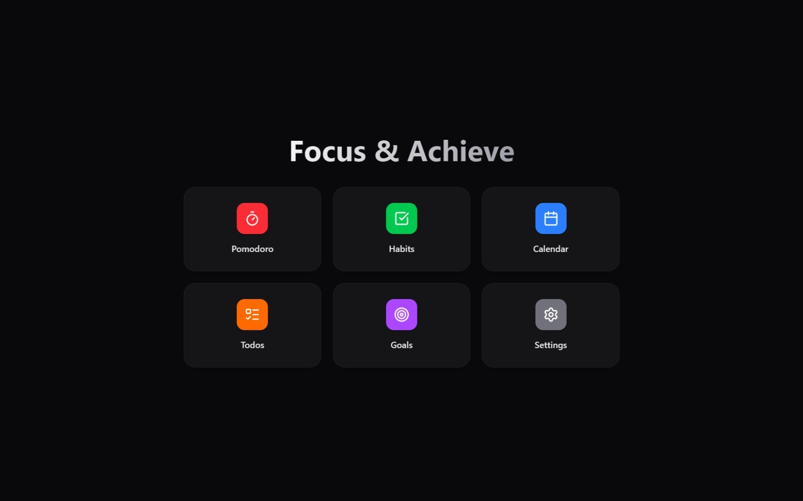
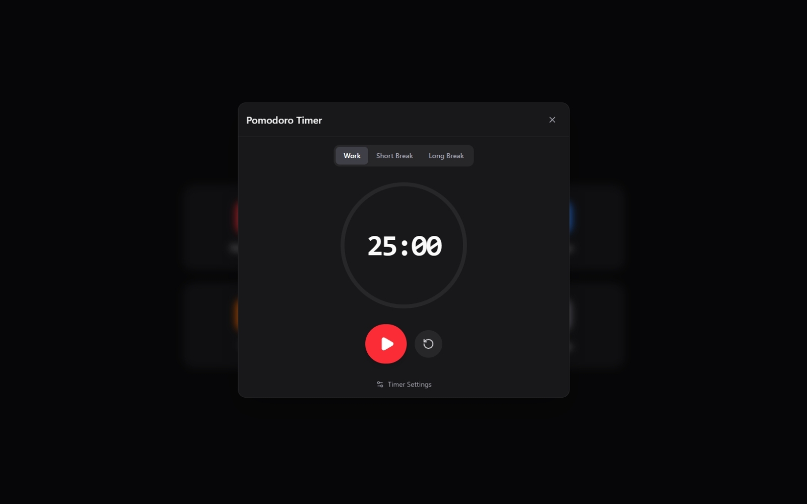
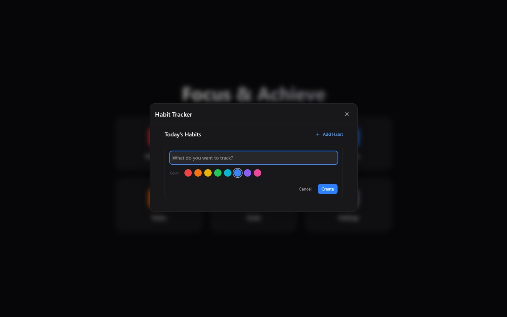
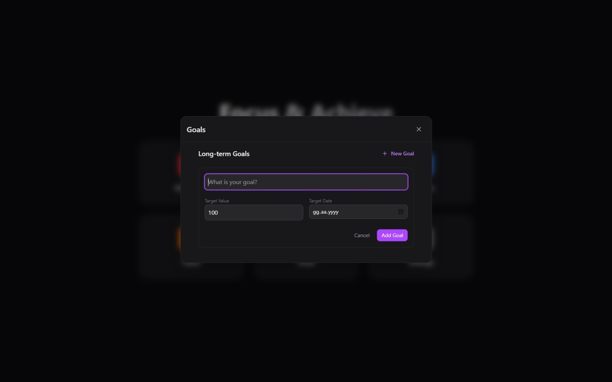

<div align="center">

# 
  
  **The Ultimate Social Productivity & Focus Application**
  
  [](LICENSE)
  [](https://github.com/PomoHub/PomoHub/releases)
  [](https://github.com/PomoHub/PomoHub/releases)
  [](https://github.com/PomoHub/PomoHub/releases)
  [](https://github.com/PomoHub/PomoHub/releases)

  <br/>

  <p align="center">
    <b>Focus Together, Grow Together.</b><br/>
    Combine the power of the Pomodoro technique with social spaces, habit tracking, goal setting, and task management in a beautiful, customizable interface.
    <br/>
    <br/>
    <a href="https://github.com/PomoHub/PomoHub/releases/latest"><strong>Download for Windows & Android »</strong></a>
    <br/>
    <br/>
    <a href="#-features">Features</a> •
    <a href="#-screenshots">Screenshots</a> •
    <a href="#-tech-stack">Tech Stack</a> •
    <a href="#-getting-started">Getting Started</a>
  </p>
</div>

---

## 📸 Screenshots

<div align="center">
  
</div>

<br/>

<div align="center">
  
  
  
</div>

---

## ✨ Features

### 🍅 **Smart Pomodoro Timer**
- **Customizable Modes:** Work, Short Break, Long Break.
- **Visual Progress:** Elegant circular indicators and progress bars.
- **Session Logging:** Automatic tracking of focus time.
- **Window Title Timer:** See your countdown even when the app is minimized.

### 👥 **Social Spaces (New in v0.2.0)**
- **Create Spaces:** Private rooms to invite friends and focus together.
- **Real-time Chat:** Communicate with your team or friends.
- **Live Status:** See who is focusing and who is on break.
- **Cross-Platform:** Syncs seamlessly between Desktop and Android.

### ✅ **Habit Tracker**
- **Daily Tracking:** Build consistency with daily check-ins.
- **Streak Logic:** Visual cues (fire icons, color coding) to keep you motivated.
- **Customization:** Assign colors and emojis to your habits.

### 📝 **Task Management**
- **Todo List:** Organize tasks with due dates and priority.
- **Smart Sorting:** Auto-prioritizes uncompleted tasks.
- **Note Taking:** Rich text notes with drawing support and attachments.
- **Smart Macros:** Create tasks directly from your notes (e.g., `@create-todo`).

### 🎯 **Gamification & Goals**
- **Long-term Goals:** Set numeric targets (e.g., "Read 10 Books").
- **Achievements:** Unlock badges as you progress.
- **Profile Stats:** Detailed statistics on your productivity journey.
- **Seasonal Effects:** Enjoy special themes like Winter Snowfall.

### ⚙️ **Customization & Privacy**
- **Themes:** Light, Dark, and System modes.
- **Backgrounds:** Set custom wallpapers for your dashboard.
- **Local First:** Your data belongs to you. Sync is optional.

---

## 🛠 Tech Stack

**Core**
<br/>


**Frontend**
<br/>


**Data & State**
<br/>


---

## 🚀 Getting Started

### Prerequisites

- **Node.js** & **Bun**
- **Rust** (latest stable)
- **Visual Studio Build Tools** (Windows only, "C++ Desktop Development")
- **Android Studio** (for Android build)

### Installation

1.  **Clone the repository**
    ```bash
    git clone https://github.com/PomoHub/PomoHub.git
    cd PomoHub
    ```

2.  **Install dependencies**
    ```bash
    bun install
    ```

3.  **Run in Development Mode**
    ```bash
    # Desktop
    bun run tauri dev

    # Android (with emulator/device connected)
    bun run tauri android dev
    ```

4.  **Build for Production**
    ```bash
    # Desktop
    bun run tauri build

    # Android APK
    bun run tauri android build
    ```

---

## 🗺️ Roadmap

### v0.1.x - Foundation (Completed)
- [x] Core Pomodoro Timer
- [x] Habit Tracker & Todo List
- [x] Calendar & Statistics
- [x] Note Taking System
- [x] Android Support

### v0.2.0 - The Social Update (Current)
- [x] **Social Spaces:** Private rooms for group focus.
- [x] **Real-time Chat:** WebSocket-based messaging.
- [x] **Cloud Sync:** Sync data across devices.
- [x] **Mobile Optimization:** Full responsive design.

### v1.0.0 - The Future (Planned)
- [ ] **Public Spaces:** Join community focus rooms.
- [ ] **Advanced Analytics:** Heatmaps and trend analysis.
- [ ] **Plugin System:** Community-created extensions.
- [ ] **Web Version:** Access PomoHub directly from the browser.

---

## 📄 License

Distributed under the MIT License. See `LICENSE` for more information.

<div align="center">
  
</div>

<div align="center">
  <br/>
  <p>Made with ❤️ by the PomoHub Team</p>
</div>
